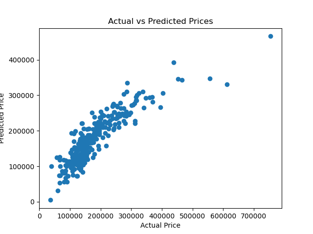

# Prodigy Infotech Data Science Internship

## Task 1: House Price Prediction using Linear Regression

---

## 📌 Objective

To build a machine learning model that predicts house prices based on features like living area, number of bedrooms, bathrooms, and overall quality.

---

## 📊 Dataset

House Prices dataset from Kaggle:
https://www.kaggle.com/c/house-prices-advanced-regression-techniques/data

---

## ⚙️ Steps Performed

* Loaded dataset using Pandas
* Selected important features (GrLivArea, BedroomAbvGr, FullBath, OverallQual)
* Handled missing values
* Split data into training and testing sets (80:20)
* Trained a Linear Regression model
* Predicted house prices
* Evaluated model using MAE, MSE, and R² Score
* Visualized results using scatter plot

---

## 🛠️ Tools & Technologies

* Python
* Pandas
* NumPy
* Scikit-learn
* Matplotlib

<<<<<<< HEAD
---

## 📈 Results

* MAE: 28290.36
* MSE: 1832990106.76
* R² Score: 0.7610

---

## 📊 Output Visualization

=======
## 📊 Dataset

House Prices dataset from Kaggle:
https://www.kaggle.com/c/house-prices-advanced-regression-techniques/data

## ⚙️ Process

1. Data loading and preprocessing
2. Feature selection
3. Train-test split (80:20)
4. Linear Regression model training
5. Prediction on test data
6. Evaluation using MAE, MSE, and R2 Score
7. Visualization of results

## 📈 Results

* MAE: 28290.36
* MSE: 1832990106.76
* R2 Score: 0.7610

## 📊 Output Visualization

>>>>>>> eac1dcc4b016e44d670f73efbf7bf7cf2d8b9804


Scatter plot showing Actual vs Predicted prices.

<<<<<<< HEAD
---

=======
>>>>>>> eac1dcc4b016e44d670f73efbf7bf7cf2d8b9804
## ▶️ How to Run

1. Install required libraries
2. Place dataset (`train.csv`) in the project folder
3. Run the script:

   ```
   python linear_regression_model.py
   ```

<<<<<<< HEAD
---

## ✅ Conclusion

The model achieved good accuracy with an R² score of 0.76, indicating a strong relationship between selected features and house prices. The predicted values are reasonably close to actual values. Further improvements can be made by adding more features and applying advanced machine learning models such as Random Forest or Gradient Boosting.
=======
## ✅ Conclusion

The model achieved good accuracy with an R2 score of 0.76, indicating a strong relationship between selected features and house prices. The predicted values are reasonably close to actual values. Further improvements can be made by adding more features and using advanced machine learning models such as Random Forest or Gradient Boosting.
>>>>>>> eac1dcc4b016e44d670f73efbf7bf7cf2d8b9804
