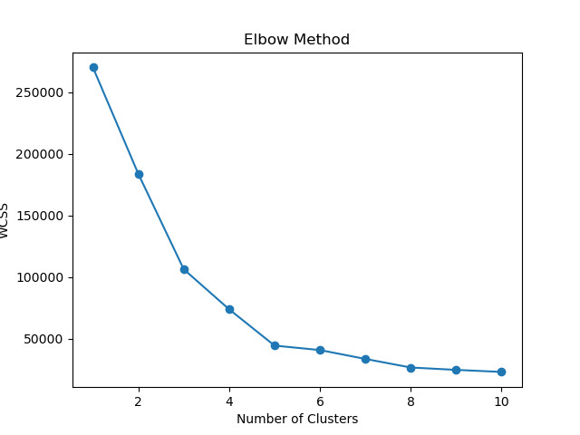
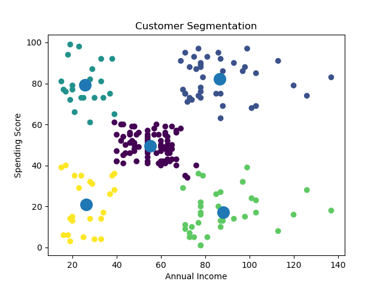

# Prodigy Infotech Data Science Internship

## Task 2: Customer Segmentation using K-Means Clustering

---

## 📌 Objective

To group customers of a retail store based on their purchase behavior using K-Means clustering.

---

## 📊 Dataset

Customer Segmentation dataset from Kaggle:
https://www.kaggle.com/datasets/vjchoudhary7/customer-segmentation-tutorial-in-python

---

## ⚙️ Steps Performed

* Loaded dataset using Pandas
* Selected important features (Annual Income, Spending Score)
* Applied Elbow Method to find optimal number of clusters
* Trained K-Means clustering model
* Predicted customer segments
* Visualized clusters and centroids

---

## 🛠️ Tools & Technologies

* Python
* Pandas
* NumPy
* Scikit-learn
* Matplotlib

---

## 📈 Results

* Optimal clusters identified using Elbow Method
* Customers grouped into 5 distinct segments
* Visualization clearly shows customer distribution

---

## 📊 Output Visualization

### Elbow Method

### Customer Segmentation

---

## ▶️ How to Run

1. Install required libraries
2. Place dataset (`Mall_Customers.csv`) in project folder
3. Run the script:

   python kmeans_customer_segmentation.py

## ✅ Conclusion

K-Means clustering successfully segmented customers into different groups based on income and spending behavior. This helps businesses understand customer patterns and target specific groups for marketing strategies.
